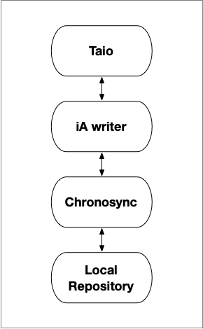
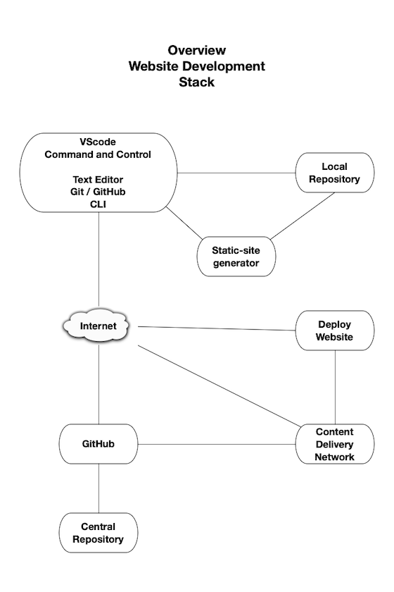

# Colophon

---

# Static-Site Generators

```admonish info
The troika of [HTML](https://developer.mozilla.org/en-US/docs/Web/HTML), [CSS](https://developer.mozilla.org/en-US/docs/Web/CSS), and [JavaScript](https://developer.mozilla.org/en-US/docs/Web/JavaScript) website programming languages have become standard for creating website pages. The web browser interprets the standard troika languages and renders the website.

The job of a static-site generators is to compile the website pages written in troika and non troika programming languages such as Markdown, into a single file only containing a combination of standard troika languages.

A web browser loads the website single file from the website server and interprets and renders the website. 

```

## mdBook

[mdBook](https://rust-lang.github.io/mdBook/) is a static-site generator used to create and maintain the  [Johntelford](https://johntelford.com) website.  mdBook is a single-page application command line tool to create books with Markdown. It is ideal for creating  documentation, tutorials, course materials or any brochureware that requires a clean, easily navigable and customizable presentation. It does not use [React](https://reactjs.org/).

## Docusaurus

[Docusaurus](https://docusaurus.io/) is a static-site generator used to create and maintain the [TechTalkJohn](https://techtalkjohn.com) blog. It builds a single-page application with fast client-side navigation, leveraging the full power of [React](https://reactjs.org/) to make websites 

---

# Website Text Material

 

The [Johntelford](https://johntelford.com) and  [TechTalkJohn](https://techtalkjohn.com) websites  use these application to create and maintain website Markdown text material. 

## [iA Writer](https://ia.net/writer)
> iA Writer offers a unique writing experience that lets you concentrate and clarify your message. Used by half a million people worldwide, its powerful interface is crafted to cut out noise, let you focus on what you want to say, and help you structure and trim your text.

iA Writer is a mirror of the website Markdown text material in the Local Repository, and where text material is changed or new text material is created., and  kept synchronized using ChronoSync. Sometimes in the heat of development or defect remediation, changes are made to files on the Local Repository. iA Writer needs to be synchronized  with the Local Repository changes using ChronoSync.

## [Taio](https://taio.app) 
> A modern app for text processing on iPhone, iPad, and Mac, provides seamless experience for clipboard, markdown editing and text workflows.

Trio and iA Writer have similar functionality. Trio value added is being able to edit iA Writer files using iPhone, iPad, and Mac locally or remotely.

## [ChronoSync](https://www.econtechnologies.com/chronosync/overview.html)
> ChronoSync is a comprehensive toolkit for performing file synchronization, data backup and system bootable backups on your macOS computer.

---

# Website Development Stack



**Developer Iterative Development Stack**

When stakeholders determine a developers changes, defect fixes, or new features are ready,


