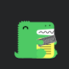

# Design Team

```admonish info
Website _Design_ is creating the website look and feel. Useful websites require the user experience and functionality be consistence and complement the content.
```

## Overview

The core foundations of a  user's website experience are:

- **Fast** - Website responds quickly to user interactions with  smooth scrolling.

- **Integrated** - The website uses the full  capabilities of the user device to create an experience true to the device.

- **Reliable** - Loads quickly and reliably even in  uncertain network conditions.

- **Engaging** - Keeps user coming back to a website that is designed to look and feel natural.


---
## Prerequisites

Website design prerequisites are making decisions about:
- Responsive Website Design
- Consistency
- Theme
- Color Scheme
- Typology
- Navigation
- User Interaction


I have reincarnated JohnTelford.com using several of these and other [Development Frameworks](https://docusaurus.io/docs#comparison-with-other-tools). The last two reincarnations have been:


### Docusaurus


  
The perquisites requirements for this website can be realized using the [Docusaurus](https://docusaurus.io) development framework. Any of the Docusaurus attributes may be changes.

The website design prerequisites can be realized using the Docusaurus development framework.

### mdBook


The [mdbook](https://crates.io/crates/mdbook) uses [markdown](https://www.markdownguide.org) with imbedded HTML. It does not abstract`React`

This website is Brochureware. I found it was faster, cleaner, and less complicated to create it using `mdbook`.

### Summary

#### Docusaurus  
Using `Docusaurus` for user interface and material because it abstracts `react`. Use `mdx` and `jsx` to creating more complex user interfaces .

#### mdBook   
mdBook is a command line tool to create books with Markdown. It is ideal for creating product or API documentation, tutorials, course materials or anything that requires a clean, easily navigable and customizable presentation.

- Lightweight Markdown syntax helps you focus more on your content
- Integrated search support
- Color syntax highlighting for code blocks for many different languages
- Theme files allow customizing the formatting of the output
- Preprocessors can provide extensions for custom syntax and modifying content
- Backends can render the output to multiple formats
- Written in Rust for speed, safety, and simplicity

[mdBook Documentation](https://rust-lang.github.io/mdBook/) is an example of what mdBook produces. The [Rust Programming Language](https://doc.rust-lang.org/book/) book is another example of mdBook in action.


---

## Responsive Website Design

The majority of users access websites using mobile devices. They and others have little tolerance for slow loading website pages or pages that do not conform to their screen size.

- Website design   
	- Ensures pages load quickly
	- Website pages are display correctly on a variety of devices and window or screen size
	- The website look and feel, users experience, and functionality are consistenly maintain.

- Consistency    
Website consistency is the look and feel of the site. The users experience, and functionality does not vary between website pages.

---

## Theme

The website theme is:

- Color scheme
- Header
- Pages
- Fonts
- Footer
- Typology
- Navigation
- User interaction

---
