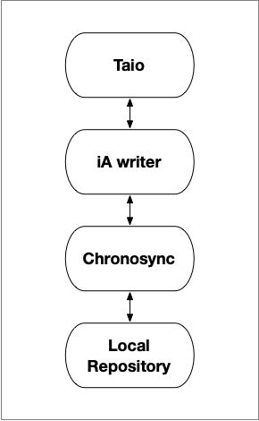

# Develop Team

```admonish info
The _Develop_ team translates the _Define_ and _Design_ processes into website pages using abstract logical structures, rigid nonhuman website programming languages, and a variety of tools. The slightest errors or security issues will require remediation sometime during the life time of the website.
```

## Prerequisites

The Develop team prerequisites are making decisions about resources required to transform the _Define_ and _Design_ work into a website, and infrastructure. This includes the site generator.

A Static Site Generator is optimum for developing and deploying brochureware websites.

---

# Static Site Generators

```admonish info
The troika of [HTML](https://developer.mozilla.org/en-US/docs/Web/HTML), [CSS](https://developer.mozilla.org/en-US/docs/Web/CSS), and [JavaScript](https://developer.mozilla.org/en-US/docs/Web/JavaScript) website programming languages have become standard for creating website pages. The web browser interprets the standard troika languages and renders the website.

The job of a static site generators is to compile the website pages written in troika and non troika programming languages such as Markdown, into a single file only containing a combination of standard troika languages.

A web browser loads the website single file from the website server and interprets and renders the website. 

```

## mdBook

[mdBook](https://rust-lang.github.io/mdBook/) is a static site generator used to create and maintain websites. An example is [Johntelford](https://johntelford.com). mdBook is a static site generators command line tool to create books with Markdown. It is ideal for creating  documentation, tutorials, course materials or any brochureware that requires a clean, easily navigable and customizable presentation. It does not use [React](https://reactjs.org/).

## Docusaurus

[Docusaurus](https://docusaurus.io/) is a static site generator used to create and maintain websites. An example is [TechTalkJohn](https://techtalkjohn.com) blog. It builds a single-page application with fast client-side navigation, leveraging the full power of [React](https://reactjs.org/) to make websites 

---

# Website Material

 

The [Johntelford](https://johntelford.com) and  [TechTalkJohn](https://techtalkjohn.com) websites are example of using these application to create and maintain website Markdown text and troika web programming materials. 

## [iA Writer](https://ia.net/writer)
> "iA Writer offers a unique writing experience that lets you concentrate and clarify your message. Used by half a million people worldwide, its powerful interface is crafted to cut out noise, let you focus on what you want to say, and help you structure and trim your text."

iA Writer mirrors website Markdown text and troika web programming materials in the local repository. iA Writer is where text material is changed or new text material is created, and kept synchronized with the local repository using ChronoSync. Sometimes in the heat of development or defect remediation, changes are made to files in the Local Repository. iA Writer needs to be synchronized  with the Local Repository changes using ChronoSync.

## [Taio](https://taio.app) 
>"A modern app for text processing on iPhone, iPad, and Mac, provides seamless experience for clipboard, markdown editing and text workflows."

Trio and iA Writer have similar functionality. Trio value added is being able to edit iA Writer files using iPhone, iPad, and Mac locally or remotely.

## [ChronoSync](https://www.econtechnologies.com/chronosync/overview.html)
>"ChronoSync is a comprehensive toolkit for performing file synchronization macOS computers"

ChronoSync is used to keep iA Write and the local repository in sync.

---


# Website Development Tools

## VScode


```admonish info
[Visual Studio Code](https://code.visualstudio.com) (VScode) is a Microsoft product.
```

It has become the goto editor for many. It is free, built on open source, and runs everywhere.

`VScode` is the command and control center for the website development stack.

Some of the development command and control tasks are:

- Editing Markdown text and troika web programming materials
- Use `git` and `GitHub` to manage project files. `Git`is built-in and optimized to work with Microsoft `GitHub`
- Editor tool extensions continually check for syntax and other errors
- Live edit browser previews show how edits will look when deployed
- Deploy secure website previews to the Internet for stakeholders
- Deploy production website to the Internet
- Built-in command shell
- And **much** more

---

```admonish info
The key _Iterative Development_ technologies are [`Git`](https://git-scm.com) and [`GitHub`](https://github.com/).
```

---

## git


```admonish info
[`Git`](https://git-scm.com/) is a free and open source distributed version control system designed to handle everything from small to very large projects with speed and efficiency.

`Git` is easy to learn and has a tiny footprint with lightning fast performance. It outclasses SCM tools like Subversion, CVS, Perforce, and ClearCase with features like cheap local branching, convenient staging areas, and multiple workflows.
```

## GitHub


```admonish info
All developers need a `GitHub` account. It is a Microsoft company
"[`GitHub`](https://github.com/) is a  Distributed Version Control Systems (DVCS) enabling multiple developers or teams to work separately without having an impact on the work of others. GitHub is a central online web hosted project repository for all project files. It is a unified source of truth. It helps teams collaborate and maintain the entire history of project file changes. Teams can view history of all changes and go back to previous file versions." 

GitHub is a unified source of truth helping to answer the questions *who* changed *what*, *where*, *when*, and *why*?
```

---

# Website Development Stack

```admonish info
The _Iterative Website Development Stack_ deploys  websites to the Internet. It is web browser agnostic. What works for big screens, works for small screens.
```


**Developer Development Stack**

Team members use the Website Development Stack. There would be confusion and possible defects created if Team members were to directly make changes to the same project repository.

A solution to this problem is to have one central repository controlled by a gatekeeper. Each team member forks a copy to their GetHub account and makes a clone of it on their workstation.

Each developer makes changes to their  clone repository. They cannot directly make changes to the central repository. Team members may deploy their copy of the clone repository with their changes, to a private Internet website for stakeholders to see and give feedback.

The process is managed using [GitHub for Teams](https://github.com/team). When stakeholders determine developers changes, defect fixes, or new features are ready, a GitHub pull request is made by developers to the central project repository. Project team members and the gatekeeper are notified by GitHub of the pull request. They may examine, comment on, suggest possible changes, and test the code. When the team agrees on developers changes, they are committed to the central project repository by the gatekeeper. This process is repeated for each developer set of changes. Iterations of the central project repository may be deployed by the gatekeeper to a private website for stakeholders viewing.

The next step is each developer pulls the central repository changes and commits them to their local copy of the central project repository. This process keeps team members up to date on changes.

The central project repository may be deployed to the public Internet by the gatekeeper after stakeholders agree there have been sufficient development and testing iterations.


