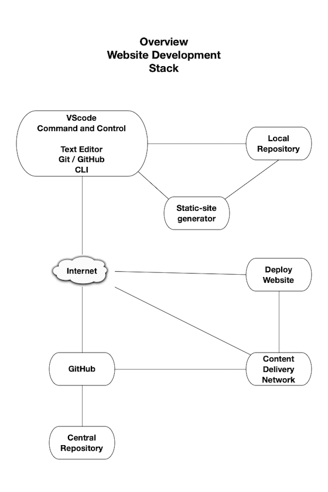
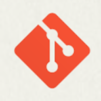

## Develop Team

>The _Develop_ team translates the _Define_ and _Design_ processes into website pages using abstract logical structures, rigid nonhuman website programming languages, and a variety of tools. The slightest errors or security issues will require remediation sometime during the life time of the website.

### Prerequisites

The Develop team prerequisites are making decisions about resources required to transform the _Define_ and _Design_ work into a website, and infrastructure. This includes the site generator 

<!-- 
 Use blog site generator link [framework](https://docusaurus.io/docs#comparison-with-other-tools) and programming tools.
-->
---

### Developer Iterative Development Stack

> The _Iterative Development Stack_ deploys  websites to the Internet. It is device agnostic. What works for big screens, works for small screens.

**Developer Iterative Development Stack**

---

#### VScode

> [Visual Studio Code](https://code.visualstudio.com) (VScode) is a Microsoft product.

It has become the goto editor for many. It is free, built on open source, and runs everywhere.

`VScode` is the command and control center for the website project.

Some of the development command and control tasks are:

- Editing code and website media
- Use `git` and `GitHub` to manage project files. `Git`is built-in and optimized to work with Microsoft `GitHub`
- Editor tool extensions continually check for syntax and other errors
- Live edit browser previews show how edits will look when deployed
- Deploy secure website previews to the Internet for stakeholders
- Deploy production website to the Internet
- Built-in command shell
- And **much** more

---

> The key _Iterative Development_ technologies are [`Git`](https://git-scm.com) and [`GitHub`](https://github.com/).

---

#### git

> [`Git`](https://git-scm.com/) is a free and open source distributed version control system designed to handle everything from small to very large projects with speed and efficiency.
>
> `Git` is easy to learn and has a tiny footprint with lightning fast performance. It outclasses SCM tools like Subversion, CVS, Perforce, and ClearCase with features like cheap local branching, convenient staging areas, and multiple workflows.

#### GitHub

> All developers need a `GitHub` account. It is a Microsoft company

[`GitHub`](https://github.com/) is a  Distributed Version Control Systems (DVCS) enabling multiple developers or teams to work separately without having an impact on the work of others. GitHub is a central online web hosted project repository for all project files. It is a unified source of truth. It helps teams collaborate and maintain the entire history of project file changes. Teams can view history of all changes and go back to previous file versions. 

It helps answer the questions who changed what, where, when, and why?

All team members have their own local copy of the central project repository. They make changes, fix defects, add new features to their repository, without interfering with others team members, or the central repository. 

Team members may deploy their copy of the repository with their changes, to a private Internet website for stakeholders to see and give feedback.

If the central online repository dies, a client repository can be copied back up to the server to restore it. 

When stakeholders determine some changes, defect fixes, or new features are ready, they will be committed to central project repository, and team members update their local copy by pulling central repository changes into their local repository. This process keeps team members up to date.

---

#### Cloudflare

 [`Cloudflare`](https://cloudflare.com/) Global [Content Delivery Network (CDN)](https://en.wikipedia.org/wiki/Content_delivery_network) deploys website to the Internet. 

`Cloudflare` builds a website and deploys it when `git` pushes changes from the _Local Repository_ to the _Central Repository_,  `Cloudflare` then automatically builds the website and deploys it to the Internet.

`Cloudflare` can be configured to deploy public production  and private development versions of the website.

### Developer Iterative Development Stack Example

The [ULTIMATE GUIDE TO USING GIT - 
With Visual Studio Code](https://yourbrainoncomputers.com/using-git-with-visual-studio-code-the-ultimate-guide/) will guide you to installing and learning git, and installing Visual Studio Code and so much more.

#### `GitHub` account
> The Iterative Development Stack depends on users having a GitHub account.

---

#### Developer Workflow

- Create a new project directory.

- Create and edit website project files.

- Follow the [ULTIMATE GUIDE TO USING GIT - 
](https://yourbrainoncomputers.com/using-git-with-visual-studio-code-the-ultimate-guide/) *Create New Git Repository* instruction.

---

 A local repository is on your workstation and a central repository on GitHub.

- Continue editing website project files.

- Every so often `commit` your changes. This insures you have a copy of the project file and project history, stored offsite in the central repository. If your workstation dies, you can quickly create a local directory on your new and improved workstation from the remote repository.

- See the [ULTIMATE GUIDE TO USING GIT
](https://yourbrainoncomputers.com/using-git-with-visual-studio-code-the-ultimate-guide/). - *Commit a Change to Git*

---

#### Website Workflow

- Website [`mdBook`](https://rust-lang.github.io/mdBook/) files are created and edited in the local repository. 

- The `mdBook serve` command renders project file edits in a browser. If viewing the page being edited, it will be updated in near real time.

- The next step is to commit file changes. The `VScode` `git` works with GitHub to update the  central repository with the local repository file changes.

- `Cloudflare` is notified by GitHub when the project central and deploys a website.

---

### Team Iterative Development Stack Workflow

The Team Iterative Development Stack is the same as Developer Iterative Development Stack. The difference is there are more than one developer. There would be confusion and possible defects created if the developers were to directly make changes to the same repository.

A solution to this problem is to have one central repository controlled by a gatekeeper. Each team member `fork`s a copy to their GetHub account and makes a `git clone` of it on their workstation. 

Each developer makes changes to their `git clone` repository. They cannot directly make changes to the central repository. Team members may deploy their copy of the clone repository with their changes, to a private Internet website for stakeholders to see and give feedback.

This process is managed using Microsoft free [Git Hub for Teams](https://github.com/team) product. When stakeholders determine a developers changes, defect fixes, or new features are ready, a GitHub `pull` request is made by the developer to the central project repository. Project team members and the gatekeeper are notified by GitHub of the `pull` request. They may examine, comment on, suggest possible changes, and possibly test the code. When the team agrees on the developers changes, they are committed to the central project repository by the gatekeeper. This process is repeated for each developer changes. Iterations of the central project repository may be deployed by the gatekeeper to a private website for stakeholders viewing.

The next step is each developer `pull`s the central repository changes and commits them to their copy of the central project repository. This process keeps team members up to date

The central project repository may be deployed to the public Internet by the gatekeeper after stakeholders agree there have been sufficient iterations.

---

