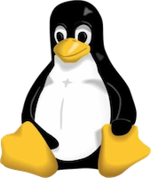

# Linux

---

[Linux](https://www.linux.org/) is an excellent example of free and open-source software collaboration. The source code may be used, modified and distributed commercially or non-commercially by anyone under the terms of its respective licenses

Linux is the leading operating system on web servers. Its greatest success in the consumer market is mobile device. Android being one of the dominant smartphones Linux-based operating system

There are a some Linux vendor supported hardware platforms or Linux software distributions. The diversity of Linux distributions means that not all software or hardware runs all distributions or applications. Software and software repositories may be specific to a particular distribution

Not all peripheral device vendors support Linux. The Linux open-source community supplies several missing device drivers.

The price of Linux-based systems is attractive. The operating system software is free. Ready-made hardware platforms are available, or can be bare metal built by choosing hardware and software components, and having the skills to assemble and maintain them.

The robustness, reliability, security, and speed of Linux systems varies from low to high, depending on the knowledge and skills of the vendors, builders and maintainers

Responsibility for maintaining Linux workstation hardware, operating systems, and device drivers is fragmented or doesn't exist, except from the vendors, builders and maintainers

There are computer repair services that are equipped to diagnosed and repaired Linux systems, but not to the extent of Apple Stores

---
