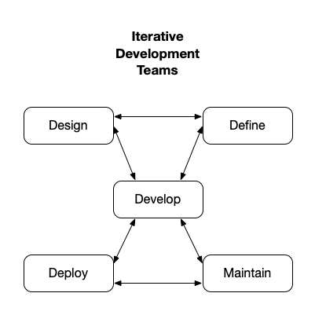

# Overview

>This website discusses optimizing website project life time costs. It describes a site generator for developing and deploying websites. It is based on *Iterative Development* and *Web Component Technologies*.
>
>The basic idea behind *Iterative Development* is to develop a system through repeated cycles (iterative) and in smaller portions at a time (incremental), allowing iterative development teams to take advantage of what was learned during development of earlier parts or versions of the system. 
>
>*Web Component Technologies* enable creating reusable custom elements, with their functionality encapsulated away from the rest of the code, and utilized in website development.
>
>Iterative web development teams working together can help optimizing website costs and lower some the difficulties creating websites.

---

## Difficulties

Creating and maintaining websites that meet users needs are difficult, complex, time consuming.

Website life time cost will be higher if defects are not mitigated early.

## Slow

More than half of mobile user will leave a page that takes longer than 3 seconds to load and may never return. Optimizing websites to maximize performance is important.

## Content

Most People visit websites for content. They have little interest in how the content is created or how it gets to their screen. Most access websites using mobile devices. Everyone wants websites pages to load quick and pages that conform to their screen size. The website look and feel, users experience, functionality, also needs to be consistent and complement the content.

The Google [PageSpeed Insights](https://pagespeed.web.dev/) website reports on the performance of a website page on both mobile and desktop devices, and provides suggestions on how pages may be improved.

Google reports mobile website pages load within 22 seconds on average. However, 53 percent of mobile users will leave a page that takes longer than 3 seconds to load.

---

## Iterative Development Teams

Teams work together delivering their work to other teams for the life time of website.

The slightest errors or security issues will require remediations sometime during the life time of the website.

This website discusses optimizing website project life time costs. It describes a framework for developing and deploying websites. It is based on _Iterative Development_ and _web component technologies_.

---

**Iterative website development**

---

Iterative website development enables the _Define, Design, Develop, Deploy and Maintain_ teams to be operational at the same time, including testing and remediating defects.

---

## Defect Remediation Costs

It is possible that the highest cost over the life time of a website project may be remediating defects.

Content and software defects cost less when found early, as this chart shows:

---

**Defect Remediation Costs**

---

Some of the early defect detection mechanisms built into the site generator are:

- `vscode` editor tool extensions continually check for syntax and other errors
- Fast refresh live-editing quickly show changes while typing, and any runtime errors
- Team members may frequently deploy their copy of the project repository with their changes to private websites where stakeholders can see them and give feedback.

---

## Minimum Viable Product

The first goal of website development project is get to a _Minimum Viable Product_. It is a way to understand whether the website project idea will work or not. It is a stage in website development where the _must_ features are implemented and ready to test with end-users. It gives feedback about the positive aspects and shortcomings.

The next steps are adding the _want_ features, until stakeholders agree the website is production quality and ready to be deployed.

---

