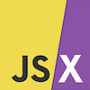

# Programming

---

## Languages

```admonish info
The troika of [HTML](https://developer.mozilla.org/en-US/docs/Web/HTML), [CSS](https://developer.mozilla.org/en-US/docs/Web/CSS), and [JavaScript](https://developer.mozilla.org/en-US/docs/Web/JavaScript) website programming languages have become standard for creating website pages, They are interpreted and rendered by web browsers.

The job of a website development frameworks is to compile the troika and non troika programming languages, such as MDX and JSX,  into a combination the standard troika languages to be executed in web browsers.
```

---

## Hypertext Markup Language (HTML)


[HTML](https://developer.mozilla.org/en-US/docs/Web/HTML) is used to create websites. It is the standard markup language for browser website pages. It defines the content and structure of website pages. HTML  can be assisted by  Cascading Style Sheets ([CSS](https://developer.mozilla.org/en-US/docs/Web/CSS)) to instruct browsers how elements are to be styled and rendered, and [JavaScript](https://developer.mozilla.org/en-US/docs/Web/JavaScript) is for user interactivity.

---


## JavaScript

>Not to be confused with the [Java](https://www.java.com/en/download/help/whatis_java.html) programming language.


[JavaScript](https://developer.mozilla.org/en-US/docs/Web/JavaScript) Used to make webpages interactive. It is the programming language of the web. It is the most popular website programming language choice for the million of programmers globally. It is a high-level language, flexible and expressive enough to write website applications. It has many advantages. It is dynamically typed, requires no compile step, and has a huge ecosystem that provides powerful frameworks, libraries, and other tools. JavaScript is one of the core technologies of website [troika](http://localhost:3000/docs/programming#languages) website programming. It enables interactive web pages and is an essential part of web applications. All contemporary web browsers have a dedicated JavaScript virtual machine built-inn to execute it.

---

## CSS


[CSS](https://developer.mozilla.org/en-US/docs/Web/CSS) (Cascading Style Sheets) is a stylesheet language used to describe the presentation of a document written in [HTML](https://developer.mozilla.org/en-US/docs/Web/HTML)

CSS instructs browsers how elements are to be styled and rendered.

---

## JSX



[JSX](https://reactjs.org/docs/introducing-jsx.html#Next.js-focus-wrapper) (JavaScript eXtended) is a statically-typed syntax extension to JavaScript. It enables writing [HTML](https://developer.mozilla.org/en-US/docs/Web/HTML) in JavaScript. JSX converts HTML tags into React elements. It is compiled to JavaScript.

---

## MDX


[MDX](https://mdxjs.com/) is Markdown for the component era. It enables seamlessly writing JSX in Markdown documents. It is compiled to JSX components, It enables using Markdown’s terse syntax for writing website media, and JSX for components.


Markdown is a faster way of creating and maintaining website material. It is a HTLM abstraction that is compiled to web standard [HTML](https://developer.mozilla.org/en-US/docs/Web/HTML)

John Gruber published the original Markdown Syntax Guide. Different flavors of Markdown have evolved since then.

> "Markdown is a better way to write HTML. It is compiled into HTML at deploy time. Markdown is a lightweight plaintext markup language used to add formatting elements to documents. Markdown is now one of the world’s popular markup languages. Using Markdown is different from using a WYSIWYG editor. In an application like Microsoft Word, you click buttons to format words and phrases, and the changes are visible immediately. Markdown is not like that. In a Markdown-formatted file. Markdown syntax is added to the text to indicate which words and phrases look different."

Markdown has been characterized by an informal specification and a reference implementation for conversion to HTML. Over time, many Markdown implementations have appeared. They are driven by the need for additional features like tables, footnotes, definition lists, and HTML inside Markdown blocks. The behavior of additional features diverge from the reference implementation and informal specification, and have attracted attention. Not all flavors of Markdown are compatible or supported by all frameworks.

I'm hesitant creating website material without using a version of Markdown. My preference is using MDX.

---

